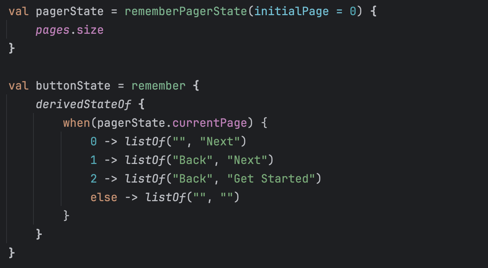
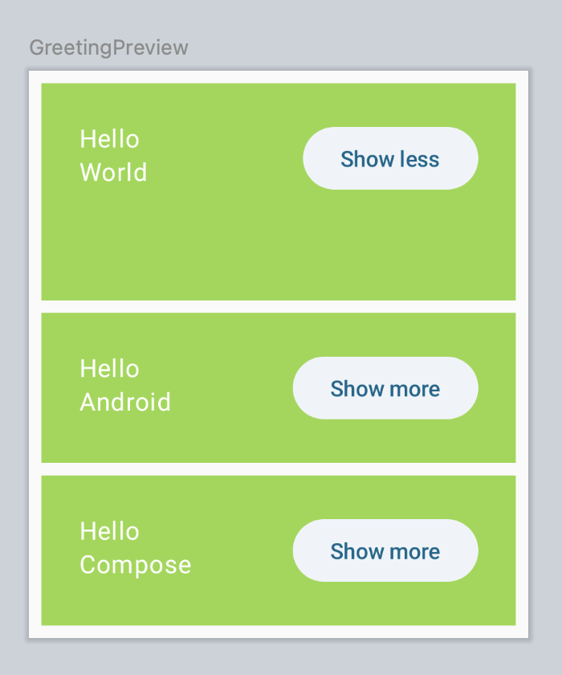
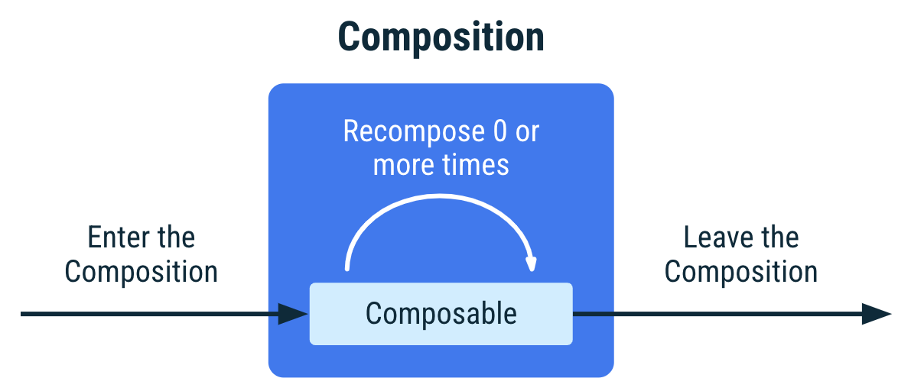

### 💡들어가기

- 해당 주제에 대한 선정이유 (순수하게 궁금해서 이런것도 OK)
    - Compose가 처음인데 remember가 가장 기본이 되는 용어인 것 같아서 선정했습니다 !
- 참고자료 레퍼런스
    - https://developer.android.com/codelabs/jetpack-compose-basics?hl=ko#12
    - https://everyday-develop-myself.tistory.com/357
    - https://dongtrivia.com/entry/Android-JetPack-Compose-%EC%97%90%EC%84%9C-%EC%83%81%ED%83%9C-%EA%B4%80%EB%A6%AC-remember


### 💻 코드



**`키워드`** : **remember, rememberPagerState, derivedStateOf**

# remember API

### 객체를 메모리에 저장하는 기능


- state(상태)를 관리하고, recomposition(컴포지션 재구성) 동안 상태를 유지하는 데 사용되는 함수
- 이를 통해 UI의 일관성과 성능을 향상시킨다.

**상태 유지**

- Recomposition될 때 이전에 저장된 값을 기억한다. → 불필요한 계산 방지, 사용자의 인터랙션 상태 유지

**메모리 관리**

- **Composable의 생명주기에 따라 메모리를 효율적으로 관리**한다. → Composable이 사라지면 remember로 저장된 값도 자동으로 사라진다.

## remember 선언 방식

```kotlin
val a = remember { mutableStateOf(false) } // a.value
var b by remember { mutableStateOf("a") } // b -> 단순한 text 
val (c,d) = remember { mutableStateOf("") }
```

# 💻 버튼으로 접기/펼치기 실습


<Show more> 버튼을 클릭하면 펼쳐지고, 
<Show less> 버튼을 클릭하면 접히는 실습

**`방법`**

1. expanded 변수 & if문
2. mutableStateOf
3. ***remember***

## 1. expanded 변수 생성 & if문을 통한 Text 변경 `X`

expanded 변수를 생성하고, if문을 통해서 Text를 바꾼다.

**`코드`**

```kotlin
@Composable
fun Greeting(name: String, modifier: Modifier = Modifier) {
    **var expanded = false**

    Surface(
        color = Color(0xFF95D847),
        contentColor = MaterialTheme.colorScheme.onPrimary,
        modifier = modifier.padding(vertical = 4.dp, horizontal = 8.dp)
    // modifier (선택) : 수정자 -> 여기에 padding이나 UI 요소를 추가한다.
        // 수정자는 상위 요소 레이아웃 내에서 UI 요소가 배치되고 표시되고 동작하는 방식을 UI 요소에 알려준다.
    ) {
        Row(modifier = Modifier.padding(24.dp)) {
            Column(modifier = Modifier.weight(1f)
            ) {
                Text(text = "Hello ")
                Text(text = name)
            }
            ElevatedButton(onClick = {
                **expanded = !expanded**
            }) {
                **Text(if (expanded) "Show less" else "Show more")**
            }
        }
    }
}
```

### 결과

<aside>

`expanded` 변수에 다른 값을 설정해도 Compose에서 이 값을 `상태 변경`으로 감지하지 않으므로 아무 일도 일어나지 않는다.

</aside>

**⇒ expanded 변수를 Compose에서 추적하고 있지 않다.**

### 그렇다면 Compose는 어떤 것들을 추적할까?

<aside>

Jetpack Compose는 `State`, `MutableState`, `StateFlow`, `LiveData`, `remember`, `derivedStateOf` 등과 같은 **상태 관리 도구**를 통해 데이터를 추적하고, 상태 변화 시 자동으로 필요한 컴포저블을 재구성합니다.

</aside>

### Recomposition

Compose 앱은 구성 가능한 함수를 호출하여 **데이터를 UI로 변환**한다.

데이터가 변경되면 Compose는 새 데이터로 이러한 함수를 다시 실행하여 업데이트된 UI를 만든다.

Compose는 **데이터가 변경된 구성요소만 다시 구성**하고, **영향을 받지 않는 구성요소는 건너뛰도록** 개별 컴포저블에서 필요한 데이터를 확인한다.


## 2. mutableStateOf로 변수 생성 `X`

### State, MutableState

- 어떤 값을 보유하고, 그 값이 변경될 때마다 UI 업데이트(Recomposition)를 트리거하는 인터페이스

**`코드`**

```kotlin
val expanded = mutableStateOf(false)
```

**`결과`**

<aside>

문제점 : Composable 내의 변수에 mutableStateOf를 할당하면, false 값을 가진 변경 가능한 새 상태로 상태를 재설정하여 Composable을 다시 호출하게 되면 언제든지 Recompostion이 일어날 수 있다.

</aside>

## 3. remeber 변수 사용 `O`

remember : Recomposition을 방지하는데 사용

<aside>
🌈 **remember** 변수를 사용해서 변경 가능한 상태를 기억한다.

</aside>

원래는 Recomposition이 될 때마다 컴포넌트 안에 명시한 변수가 초기화되는데, 
remember를 사용하면 **최초 Initial Composition때만 초기화를 진행하게 된다.**

# @Composable의 생명주기



1️⃣ **Initial Composition : Composable이 처음 생성될 때 → 각 UI 요소를 적절한 위치와 함께 트리에 추가**

2️⃣ **Recomposition : UI를 구성하는 데이터가 변경되었을 때 (State가 바뀌거나, Composable 함수의 매개)**

3️⃣ **Decomposition : Composable이 파괴될 때**

```kotlin
@Composable
fun MyComposable(**str**: String) {
		Text(text = str)
}
```

→ MyComposable은 str을 사용하고 있기 때문에 **str이 변경되어 들어오면** MyComposable은 **recomposition**을 하게 된다.


# rememberSaveable
remember + 구성 변경(Ex. 화면 회전)시에도 상태 유지

### 동작 원리

1. 상태 저장
    - 상태를 Bundle에 저장한다. onSaveInstanceState와 유사하게 동작하여 컴포저블이 구성 변경을 겪어도 상태가 보존된다.
2. 상태 복원
    - 구성 변경 후, Compose는 저장된 Bundle에서 상태를 복원하여 UI에 반영한다.

### 저장되는 종류

- 기본적으로 Parcelable이나 Serializable을 구현한 객체는 자동으로 저장되고 복원된다.
- 커스텀 객체나 복잡한 데이터 타입의 경우 **`Saver 인터페이스`**를 구현하여 상태를 저장하고 복원한다.

### Saver 인터페이스

```kotlin
interface Saver<Original, Saveable : Any> {
    /**
     * Convert the value into a saveable one. If null is returned the value will not be saved.
     */
    fun SaverScope.save(value: Original): Saveable?

    /**
     * Convert the restored value back to the original Class. If null is returned the value will
     * not be restored and would be initialized again instead.
     */
    fun restore(value: Saveable): Original?
}
```

### mapSaver

- map 형태로 데이터를 저장하고, 다시 찾아온다.

```kotlin
@Composable
fun Person() {
    val person = rememberSaveable(saver = PersonSaver.saver) {
        Person(
            "준형",
            27,
            true
        )
    }
}

object PersonSaver {
    val saver = mapSaver(
        save = { person: Person ->
            mapOf(
                "name" to person.name,
                "age" to person.age,
                "isMan" to person.isMan,
            )
        },
        restore = {
            Person(
                it["name"] as String,
                it["age"] as Int,
                it["isMan"] as Boolean,
            )
        }
    )
}
```

### listSaver

- list 형태로 데이터를 저장하고 index를 통해 다시  찾아온다.

```kotlin
object PersonSaver {
    val saver = listSaver(
        save = { person: Person ->
            listOf(
                person.name,
                person.age,
                person.isMan,
            )
        },
        restore = {
            Person(
                it[0] as String,
                it[1] as Int,
                it[2] as Boolean,
            )
        }
    )
}
```

### 실행 예시

1. 기기 회전 시 온보딩 화면 재로딩
    - 기기에서 앱을 실행하고 버튼을 클릭한 다음 회전하면 온보딩 화면이 다시 표시된다.
        - **`remember 함수는 Composable이 Composition에 유지되는 동안에만 작동`**하기 때문이다.
        - 기기를 회전하면 전체 활동이 다시 시작되므로 모든 상태가 손실된다.
        - 구성이 변경되거나 프로세스가 중단될 때도 발생한다.
    - → 해결방법) remember 대신 rememberSavable을 사용하면 된다.
    
    ```kotlin
    var shouldShowOnboarding by rememberSaveable { mutableStateOf(true) }
    ```
    

1. 목록 항목의 펼쳐진 상태 유지
    - 목록 항목을 펼친 다음 항목이 보이지 않을 때까지 목록을 스크롤하거나, 기기를 회전한 다음 펼쳐진 항목으로 돌아가면 이제 항목이 초기 상태로 돌아온 것을 확인할 수 있다.
    - → 해결방법) remember 대신 rememberSaveable을 사용한다.
    
    ```kotlin
    var expanded by rememberSaveable {mutableStateOf(false)}
    ```
    

---

### 그러면, remember 대신 항상 rememberSaveable을 사용하면 되는거 아니야!?

**`성능 이슈`**

- rememberSaveable은 상태가 Bundle이나 SavedInstanceState에 저장되므로, 상태가 직렬화 가능한 형태(기본 타입, Parcelable, Serializable)이어야 한다.
- 따라서 UI에서만 잠시 필요한 간단한 데이터라면 remember만으로 충분하다.

**`결론`**

- rememberSaveable은
    - 화면 회전이나 활동 재생성 후에도 상태를 유지해야 할 때,
    - 입력 값, 설정, 사용자 선택 등 유지가 중요한 상태를 다룰 때 사용하자 !

<aside>

>상태 유지의 필요성, 성능 요구사항 등을 고려해 적절한 것을 선택해 성능과 복잡성을 관리하는게 중요함 !!

</aside>


# rememberPagerState, derivedStateOf, rememberCoroutineScope


### rememberPagerState

Jetpack Compse의 Pager 컴포넌트의 상태를 관리하기 위해 사용되는 API

Pager의 현재 페이지, 스크롤 위치, 애니메이션 상태 등을 추적하고 Recomposition 시에도 상태를 유지한다.

```
**currentPage**: 현재 활성화된 페이지 인덱스
**pageCount**: Pager내 페이지의 총 개수
**currentPageOffsetFraction**: 현재 페이지와의 스크롤 offset(0~1)
```

### derivedStateOf → 더 찾아보기

Compose에서 Derived State(파생 상태)를 생성하기 위한 도구로, 기존 상태에 기반하여 새로운 상태를 계산한다.

기존 상태가 변경될 때만 파생 상태를 다시 계산하며, 불필요한 재구성을 방지한다.

**`예시`**

```kotlin
val isLastPage = derivedStateOf { pagerState.currentPage == pagerState.pageCount - 1 }

if (isLastPage.value) {
    Text("You're on the last page")
}
```

**`코드`**

```kotlin
val pagerState = rememberPagerState(initialPage = 0) {
    pages.size
}

val buttonState = remember {
    derivedStateOf {
        when (**pagerState.currentPag**e) {
            0 -> listOf("", "Next")
            1 -> listOf("Back", "Next")
            2 -> listOf("Back", "Get Started")
            else -> listOf("", "")
        }
    }
}
```

- pagerState.currentPage 가 변경될 때만 derivedStateOf 블록이 다시 계산된다.
- 내부적으로 상태를 캐싱하여, 의존하는 상태가 변경되지 않으면 재계산을 건너뛰고 기존 값을 반환한다.

### rememberCoroutineScope

Composable 함수 내에서 Coroutine Scope를 제공하는데 사용된다.

= Compose Lifecycle과 독립적인 Coroutine Scope를 생성한다.

```kotlin
val scope = rememberCoroutineScope()

if (buttonState.value[0].isNotEmpty()) {
  NewsTextButton(
    text = buttonState.value[0],
    onClick = {
      scope.launch {
        pagerState.animateScrollToPage(page = pagerState.currentPage - 1)
      }
    }
  )
}
```

→ 버튼 클릭 시 비동기 작업을 시작하거나, 애니메이션 작업과 같은 비동기 로직을 실행할 때 사용된다.