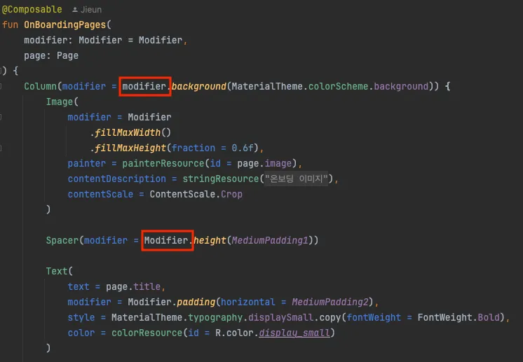

# 1. Modifier란?

### 1-1. Modifier란?

- UI의 구성 요소를 동적으로 변경하거나, 여러 UI 요소에 공통된 스타일을 적용하는 데 사용

### 1-2. Modifier의 역할

1. UI 요소 수정 : Modifier를 사용해 UI 요소의 레이아웃, 스타일, 상호작용 등을 변경할 수 있음
2. 상호 작용 설정 (행동을 추가하기 위한 Modifier) : 클릭, 스크롤, 드래그, 확대/축소 등의 상호 작용을 설정 가능
3. 구성 요소 조합 : 여러 Modifier를 연결해서 사용할 수 있어, 다양한 스타일을 조합 가능

# 2. Modifier의 체이닝

- Modifier는 체이닝 함수
- 체이닝 함수란?
    - 말 그대로 메소드들을 체인으로 엮듯이 위에서부터 엮어 호출되는 프로그래밍 패턴

### 그렇기 때문에 Modifier는 순서가 중요하다..!

첫 번째 예시

```kotlin
@Composable
fun ArtistCard(/*...*/) {
    val padding = 16.dp
    Column(
        Modifier
            .clickable(onClick = onClick)
            .padding(padding)
            .fillMaxWidth()
    ) {
        
    }
}
```


두 번째 예시

```kotlin
@Composable
fun ArtistCard(/*...*/) {
    val padding = 16.dp
    Column(
        Modifier
            .padding(padding)
            .clickable(onClick = onClick)
            .fillMaxWidth()
    ) {
        // rest of the implementation
    }
}
```

→ clickable을 먼저 호출한 Column은 padding을 적용한 공간까지 click 효과가 나타나지만,
padding을 먼저 호출한 Column은 padding을 적용한 공간에는 click 효과가 나타나지 않음

https://developer.android.com/develop/ui/compose/modifiers#order-modifier-matters
(깃허브에는 영상 업로드가 불가능해서 공식문서 링크로 대신합니다)


### 왜.. 왜…. margin이 없어..?


### xml과의 차이점

xml에서는 margin은 요소의 “바깥쪽에”, padding은 요소의 “안쪽에” 적용됨

그러나 modifier는 체이닝 함수의 특징을 이용해 동작을 명시적이고 예측 가능하게 만들어줌

→ Compose에는 margin은 없고 padding만 있는 이유 !

+ 추가적으로,



# 3. 고정된 크기를 설정할 때 사용하는 size / requiredsSize

- 기본적으로 Compose에서 제공하는 레이아웃은 하위요소의 크기에 맞춰짐 (WrapContent)

하지만! size 수정자를 이용해 크기를 임의로 정할 수 있음

size

```kotlin
modifier = Modifier.size(width = 400.dp, height = 100.dp)
```

requiredSize - 제약 조건을 무시하고 크기를 정함

```kotlin
 modifier = Modifier.requiredSize(150.dp)
```

→ 상위 요소의 크기가 100dp라고 하더라도 150dp로 크기가 설정됨

# 4. 꿀팁 아닌 꿀팁(?)

### 4-1. Modifier는 선택적 매개변수 중 가장 첫번째여야 한다

Composable 함수를 만들다보면 선택 매개변수로 주어지는 것들이 상당히 많음

그 중 Modifier는 가장 첫 번째여야 함

(개발자들끼리의 규칙이라고 하네요..!)

⭕️

```kotlin
@Composable
fun TextButton(
    text: String,
    onClick: () -> Unit,
    modifier: Modifier = Modifier,
    enabled: Boolean = true
) {
}
```

❌

```kotlin
@Composable
fun TextButton(
    text: String,
    onClick: () -> Unit,
    enabled: Boolean = true
    modifier: Modifier = Modifier
) {
}
```

### 4-2. Modifier 매개변수의 기본값은 항상 Modifier이다

Modifier 매개변수는 반드시 선택적 매개변수여야 하며, 기본값은 항상 Modifier여야 함

```kotlin
modifier: Modifier = Modifier
```

위 형태가 아닌 커스텀 된 형태로 정의한다면 사용자가 다른 Modifier를 재정의 해 전달했을 때 기존의 정의가 덮어씌워져버림 !

만약 기본적인 Modifier 속성을 정의하고 싶다면 매개변수로 받은 Modifier 뒤에 이어서 붙이기