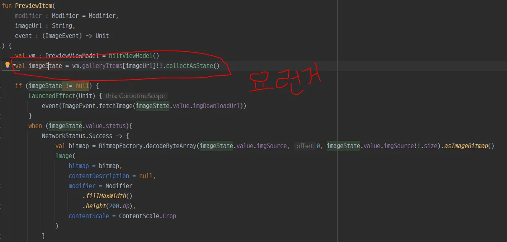
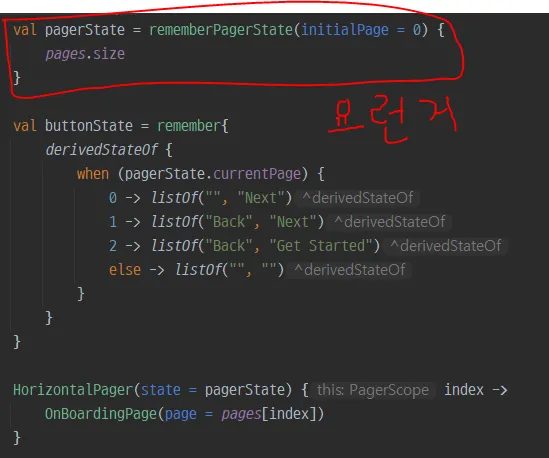
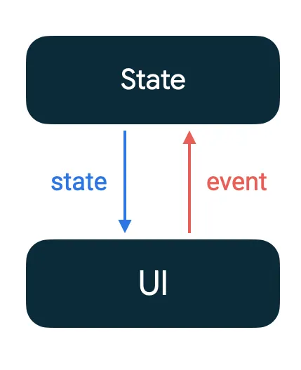
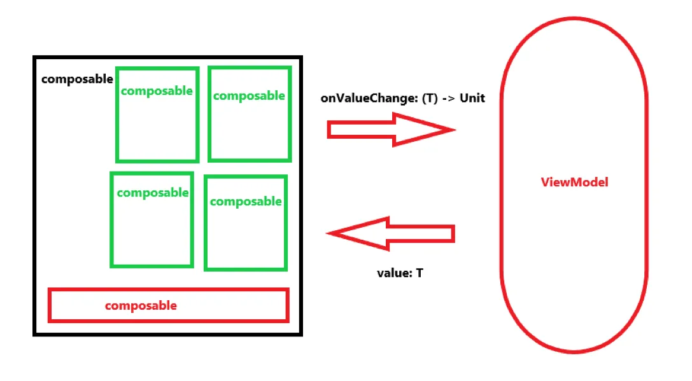
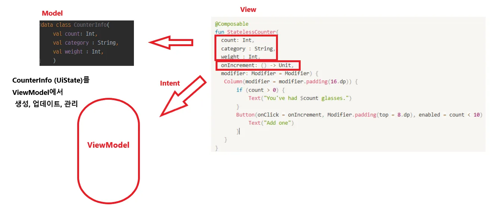
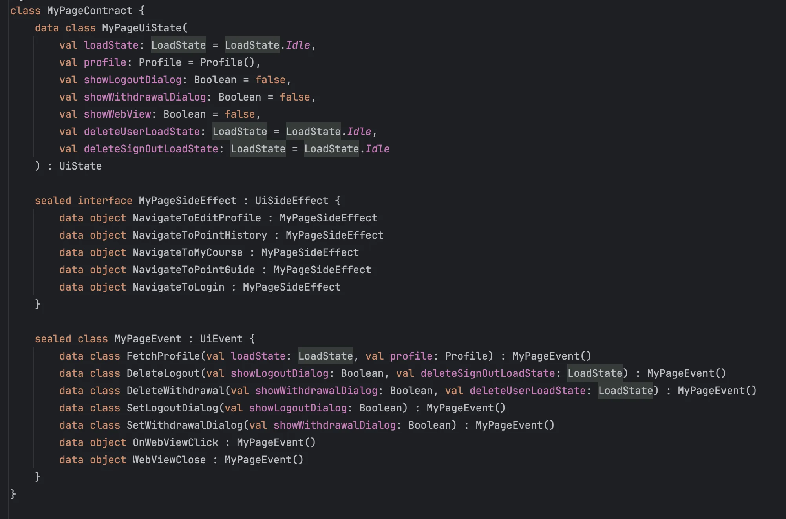

# State

💡

Compose는 선언적이므로 Compose를 업데이트하는 유일한 방법은 새 인수로 동일한 컴포저블을 호출하는 것입니다.
컴포저블이 새 상태에 따라 업데이트되려면 새 상태를 명시적으로 알려야 합니다.


**UI state 에는 두 가지 요소가 있습니다.**

- **화면 UI 상태**: 화면에 표시해야 하는 *항목*입니다. 예를 들어 `NewsUiState` 클래스에는 UI를 렌더링하는 데 필요한 뉴스 기사와 기타 정보가 포함될 수 있습니다. 이 상태는 앱 데이터를 포함하므로 대개 계층 구조의 다른 레이어에 연결됩니다.
    
    
    
- **UI 요소 상태**: 렌더링 방식에 영향을 주는 UI 요소에 고유한 속성을 나타냅니다. UI 요소는 표시하거나 숨길 수 있으며 특정 글꼴이나 글꼴 크기, 글꼴 색상을 적용할 수 있습니다.
    
    
    

# Stateful & Stateless Composable

- 내부적으로 상태를 갖고 있는 컴포저블 = Stateful Composable
- 내부적으로 상태를 갖고 있지 않는 컴포저블 = Stateless Composable

> remember를 써서 객체를 저장하는 컴포저블은 **내부 상태를 생성해서 컴포저블을 Stateful로 만든다. Stateless Composable은 상태를 갖지 않는 컴포저블**이다. 
재사용 가능한 컴포저블은 개발 시에는 동일한 컴포저블의 Stateful 버전과 Stateless 버전을 모두 노출해야 하는 경우가 있다. **Stateful 버전은 상태를 염두에 두지 않는 호출자에게 편리하며 Stateless 버전은 상태를 제어하거나 끌어올려야 하는 호출자에게 필요하다**
> 

공식문서에서는 **“실제 앱에선 컴포저블의 기능에 따라 100% Stateless로 하는 건 어려울 수 있다. 컴포저블이 가능한 한 적게 상태를 소유하고 적절한 경우 컴포저블의 API에 상태를 노출해서 상태를 끌어올릴 수 있도록 (상태 호이스팅) 컴포저블을 디자인해야 한다”** 라고 말하고 있습니다.

아래와 같은 경우를 **상태 호이스팅**이라 부릅니다.

```kotlin
@Composable
fun StatelessCounter(count: Int, onIncrement: () -> Unit, modifier: Modifier = Modifier) {
   Column(modifier = modifier.padding(16.dp)) {
       if (count > 0) {
           Text("You've had $count glasses.")
       }
       Button(onClick = onIncrement, Modifier.padding(top = 8.dp), enabled = count < 10) {
           Text("Add one")
       }
   }
}
```

```kotlin
@Composable
fun StatefulCounter(modifier: Modifier = Modifier) {
   var count by rememberSaveable { mutableStateOf(0) }
   StatelessCounter(count, { count++ }, modifier)
}
```

 Compose에서 상태 호이스팅을 하는 일반적 패턴은 상태 변수를 아래 2개의 매개변수로 바꾸는 것이다

- value: T - 표시할 현재 값
- onValueChange: (T) -> Unit - T가 제안된 새 값인 경우 값을 바꾸도록 요청하는 이벤트

위 StatelessCounter의 경우 count라는 상태를 가지고 UI를 표시하지만 이를 내부적으로 보유, 정의, 업데이트 하지 않고 그저 주입받아 UI를 그리기만 하고있다.

다만 onIncrement라는 이벤트를 통해 외부에서 count가 수정될 수 있도록 이벤트를 트리거 하고있다.

### 상태 호이스팅을 통해 Stateless 컴포저블로 만들면 좋은점?

위와 같은 방법을 사용한다면 단방향 데이터 흐름 아키텍처로 설계할 수 있습니다.

**단방향 데이터 흐름(UDF)은 상태는 아래로 이동하고 이벤트는 위로 이동하는 디자인 패턴**



### 1. **재사용성과 모듈화 증가**

- 상태를 컴포저블 내부에서 관리하면 해당 컴포저블이 특정 상태에 종속되어 재사용이 어려워집니다.
- 상태 호이스팅을 통해 상태를 상위 컴포넌트로 이동하면 컴포저블이 "stateless"해지므로, 다양한 상태를 가진 여러 부모 컴포넌트에서 재사용할 수 있습니다.

---

### 2. **단일 책임 원칙(Single Responsibility Principle) 준수**

- 상태 관리와 UI 렌더링의 역할을 명확하게 분리합니다.
- 컴포저블은 UI 렌더링에만 집중하고, 상위 컴포넌트가 상태 관리를 담당합니다.

---

### 3. **상태 동기화 및 일관성 유지**

- 여러 컴포저블이 같은 상태를 공유할 때, 상위 컴포넌트에서 상태를 관리하면 모든 컴포저블이 동기화된 상태를 사용할 수 있습니다.
- 이를 통해 데이터 불일치를 방지하고 앱의 상태 일관성을 유지할 수 있습니다.

---

### 4. **상태 흐름 제어**

- 상태 호이스팅은 "단방향 데이터 흐름(Unidirectional Data Flow)"을 구현합니다.
    - 상위 컴포넌트는 상태를 전달하고, 하위 컴포넌트는 이벤트를 상위로 전달합니다.
    - 이로 인해 상태 변경을 쉽게 추적할 수 있고, 디버깅과 유지보수가 용이해집니다.

---

### 5. **Compose의 선언형 UI 패러다임 준수**

- 선언형 UI는 상태 변경 대신 상태에 따른 UI 재구성을 중심으로 동작합니다.
- 상태를 상위 컴포넌트로 이동하면 상태 변경이 UI 전체에 자연스럽게 반영되어, Compose의 선언형 프로그래밍 방식에 부합합니다.

---

### 6. 상태 캡슐화 및 테스트 가능성

- 상태와 상태를 표시하는 UI를 분리해 격리 상태에서 더 쉽게 테스트 가능
- 상태는 한 곳에서만 업데이트할 수 있고 컴포저블의 상태에 관한 정보 소스가 하나뿐이므로, 알려지지 않은 상태로 인해 버그를 만들 가능성이 작다

### 실습 코드를 어떻게 개선해볼 수 있을까

```kotlin
@OptIn(ExperimentalFoundationApi::class)
@Composable
fun OnBoardingScreen(
    event : (OnBoardingEvent) -> Unit
){
    val scrollState = rememberScrollState()

    Column(modifier = Modifier
        .verticalScroll(scrollState).
        fillMaxSize()
    ){
        val pagerState = rememberPagerState(initialPage = 0) {
            pages.size
        }

        val buttonState = remember{
            derivedStateOf {
                when (pagerState.currentPage) {
                    0 -> listOf("", "Next")
                    1 -> listOf("Back", "Next")
                    2 -> listOf("Back", "Get Started")
                    else -> listOf("", "")
                }
            }
        }

		// ...
		// ...
		// ...
		// ...
            Row(verticalAlignment = Alignment.CenterVertically) {
                val scope = rememberCoroutineScope()

                if (buttonState.value[0].isNotEmpty()) {
                    NewsTextButton(
                        text = buttonState.value[0],
                        onClick = {
                            scope.launch {
                                pagerState.animateScrollToPage(page = pagerState.currentPage - 1)
                            }
                        }
                    )
                }

                NewsButton(
                    text = buttonState.value[1],
                    onClick = {
                        scope.launch {
                            if (pagerState.currentPage == 2) {
                                event(OnBoardingEvent.SaveAppEntry)
                            } else {
                                pagerState.animateScrollToPage(
                                    page = pagerState.currentPage + 1
                                )
                            }
                        }
                    }
                )
            }
        }
        Spacer(modifier = Modifier.weight(0.5f))
    }
}
```

```kotlin
val pagerState = rememberPagerState(initialPage = 0) {
    pages.size
}
```

해당 State의 경우 **UI 요소 상태**에 해당합니다. 즉, UI의 랜더링 방식에 영향을 주는 요소이기 때문에 오히려 Composable에 종속되어야 하는 상태이므로 굳이 호이스팅하지 않아도 됩니다.

```kotlin
val buttonState = remember{
    derivedStateOf {
        when (pagerState.currentPage) {
            0 -> listOf("", "Next")
            1 -> listOf("Back", "Next")
            2 -> listOf("Back", "Get Started")
            else -> listOf("", "")
        }
    }
}
```

해당 State의 경우 **화면 UI 상태,** 즉 화면에 표시해야 하는 *항목*입니다. 따라서 위 Composable을 재사용할 경우 pager의 페이지 수가 늘어나거나 버튼의 텍스트가 바뀔 가능성이 있는 State입니다. 

따라서 Composable의 재사용성을 위해 이 상태값을 외부로 호이스팅하면 더 좋은 설계가 될것입니다.

# 100% Stateless 컴포저블이 가능할까?

방금 예제처럼 **UI 요소 상태** 에 해당하는 State를 호이스팅하지 않는것은 Stateless 조건에 포함시키지 않겠습니다. 




이렇게 컴포저블 간에 상태를 끌어올리지 않고, 외부의 어떤 컨테이너 (ViewModel)에서 모든 상태를 관리하며, 이 상태값을 생성하고, 변경하는 이벤트들이 composable로부터 트리거되어 해당 컨테이너로 전달된다면, 100% Stateless 컴포저블로 이루어진 아키텍처를 구성할 수 있지 않을까? 라는 생각이 들었습니다.

실제로 위 아키텍처는 위에서 상태 호이스팅에 대해 설명했을 때 나왔던 단방향 데이터흐름 디자인패턴과 매우 유사하게 생겼습니다.

## 그것이 바로 MVI패턴

```kotlin
@Composable
fun StatelessCounter(
	count: Int, 
	category : String,
	weight : Int,
	onIncrement: () -> Unit, 
	modifier: Modifier = Modifier) {
   Column(modifier = modifier.padding(16.dp)) {
       if (count > 0) {
           Text("You've had $count glasses.")
       }
       Button(onClick = onIncrement, Modifier.padding(top = 8.dp), enabled = count < 10) {
           Text("Add one")
       }
   }
}
```

위의 StatelessCounter 예제를 다시 생각해봅시다. (2가지의 State를 더 추가했습니다.)


기존에는 자식 Composable의 상태값을 부모 Composable에게로 호이스팅 했죠?

그리고 그 상태값들을 모조리 부모 Composable이 관리했죠?

그치만 이번에는 

- State값을 하나로 묶어 **(Model)** 외부의 ViewModel이 관리하도록 하고,
- Composable 매서드 **(View)** 에서는 ViewModel내부에 있는 State값을 구독하여 UI를 업데이트 하기만 합니다.
- ViewModel본인은 자기마음대로 State를 변경할 수 없으니 Composable로부터 이벤트를 입력받아 **(Intent)** 적절하게 State를 변경하는 비즈니스로직을 수행합니다.

위 상호작용 과정에서 관여하는 3 개의 컴포넌트 Model, View, Intent를 아울러 MVI 패턴 이라고 부릅니다.

```kotlin
@HiltViewModel
class PreviewViewModel @Inject constructor(
    private val galleryRepository: GalleryRepository
): ViewModel() {
		// State값 관리
    private val _galleryItems = mutableStateMapOf<String, MutableStateFlow<ImageState>>()
    val galleryItems: Map<String, StateFlow<ImageState>> get() = _galleryItems
    private val _itemOrder = mutableStateListOf<String>()
    val itemOrder : List<String> get() = _itemOrder

		// View에서 Event를 전달받기 위한 브릿지 매서드
    fun handleIntent(intent: ImageEvent) {
        when (intent) {
            is ImageEvent.LoadAllImageUrls -> loadAllImgUrls()
            is ImageEvent.fetchImage -> downloadImg(intent.url)
        }
    }

		// State값을 생성, 업데이트, 관리하기 위한 내부 비즈니스 로직
    private fun loadAllImgUrls() {
        viewModelScope.launch {
            val result = galleryRepository.getImageUrls()
            result.handleResult(
                success = {
                    _itemOrder.addAll(it.data!!)
                    it.data.forEach { key ->
//                        _galleryItems[key].value = _galleryItems[key] ?: ImageState()
                    }
                },
                fail = {code, message ->
                    Log.d("teteteteet", "$code : $message")
                },
                loading = {}
            )
        }
    }

    private fun downloadImg(url : String) {
        viewModelScope.launch {
            try {
                val response = galleryRepository.fetchImage(url)
                response.handleResult(
                    success = { result ->
//                        _galleryItems[url] = ImageState(status = NetworkStatus.Success, imgDownloadUrl = url, imgSource = result.data)
                    },
                    fail = { code, message ->
//                        _galleryItems[url] = ImageState(status = NetworkStatus.Fail, imgDownloadUrl = url, imgSource = null)
                    },
                    loading = {
//                        _galleryItems[url] = ImageState()
                    }
                )
            } catch (e: Exception) {
//                _galleryItems[url] = ImageState(status = NetworkStatus.Fail, imgDownloadUrl = url, imgSource = null)
            }
        }
    }
}
```

### SideEffect? Reducer??

MVI패턴에 대한 글을 찾아보다보면 Intent의 요소 중 SideEffect, Reducer 과 같은 용어가 나옵니다.

위에서 다룬건 사실 **View를 통해 이벤트가 트리거되고, 해당 이벤트로 인해** **State가 변경되면 이를 통해 재 호출 되어 View가 Recomposition 되는 형태** 가 무한 반복되는 사이클을 기준삼았습니다.

그러나 실제 앱의 서비스는 항상 모든 흐름이 위와 같은 **Pure cycle**로 이루어 질 순 없습니다.

```kotlin
@Composable
fun ExampleButton{
    SideEffect{
	    systemUiController.setStatusBarColor(
        	color = BackgroundColor
	    )
	}
}
```

위와 같이 StatusBar의 상태를 변화시킨다거나, Toast 메시지를 띄워야 할 수 도 있습니다. 이는 State와는 관계없는 Composable 외부세계의 UI 작업이며 이를 SideEffect라고 부릅니다. 반대로 Reducer는 State를 변화시키는 작업을 수행합니다.

쉽게말하면 

- SideEffect : State의 변화와 관계없는 UI작업
- Reducer : State를 직접적으로 변화시켜 Composable에 영향을 주는 비즈니스 로직

이라고 볼 수 있습니다.

```kotlin
class CalculatorViewModel: ViewModel(), ContainerHost<CalculatorState, CalculatorSideEffect> {

    override val container =container<CalculatorState,CalculatorSideEffect>(CalculatorState())

    fun add(number :Int) = intent{//intent - 앱의 상태를 변화시키려는 의도
        postSideEffect(CalculatorSideEffect.Toast("Adding $number to ${state.total}!"))
        reduce{
 				state.copy(total = state.total + number)
		}
    }
}
```

따라서 Intent에 해당하는 이벤트 핸들링 매서드는 위와같이 SideEffect와 Reducer의 조합으로 이루어지게 됩니다.

### 결론

- MVI 패턴은 MVVM 패턴의 확장된 형태이다.
    - 기존의 XML 형식의 View 시스템에서 클린아키텍처를 도입하기 위해 ViewModel개념이 생김 → MVVM
    - 선언형 UI 시스템이 생기고, 리컴포지션 시스템을 활용하기 위해 UI에 State라는 개념이 생김
    - UI 컴포넌트들의 재사용을 위해 Stateless한 컴포넌트를 설계하기 시작
    - 기존의 MVVM패턴으로는 100%에 가까운 Stateless Composable 아키텍처를 설계하기 힘듦
    - Composable간의 단방향 데이터흐름 디자인패턴을 MVVM 아키텍처에 적용시킨 결과가 MVVM 패턴


**상태 호이스팅 장점**

1. 상태를 복제하는 것이 아니라 상태를 옮겼기 때문에 정보 소스가 하나라 버그 방지에 도움이 된다.
2. 호이스팅한 상태를 다른 Composable과 공유할 수 있다.
3. Stateless 컴포저블의 호출자가 상태를 변경하기 전에 이벤트를 무시할지 수정할 지를 결정할 수 있다.
4. Stateless 컴포저블의 상태는 어디에나 저장될 수 있으므로 구성에 용이하다.

**상태를 끌어올릴 위치를 파악하는 3가지 규칙**

1. 상태는 적어도 그 상태를 사용하는 모든 컴포저블의 가장 낮은 공통 상위 요소로 끌어올려야 한다.
2. 상태는 최소한 변경될 수 있는 가장 높은 수준으로 끌어올려야 한다.
3. 통일한 이벤트에 대한 응답으로 두 상태가 변경되는 경우에는 두 상태를 함께 끌어올려야 한다.

✔️ 자세한 내용이 궁금하시다면 공식문서!

[상태를 호이스팅할 대상 위치  |  Jetpack Compose  |  Android Developers](https://developer.android.com/develop/ui/compose/state-hoisting?hl=ko)

