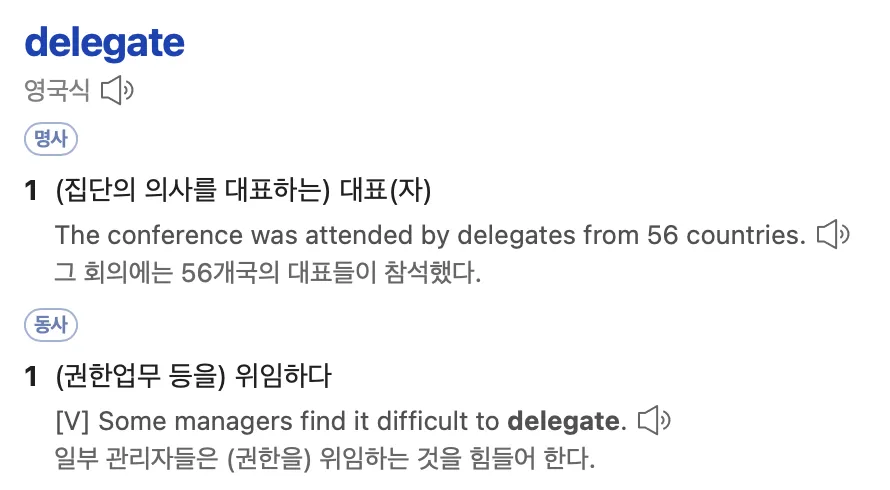
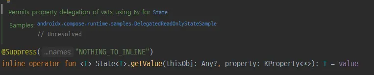
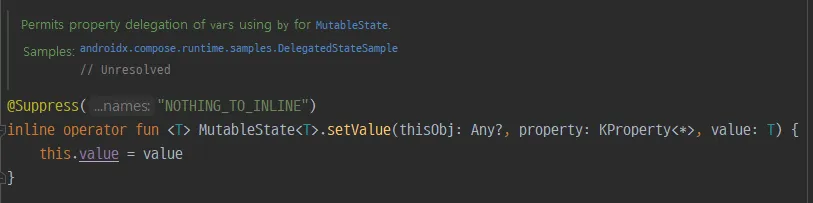
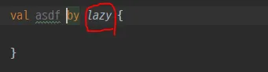
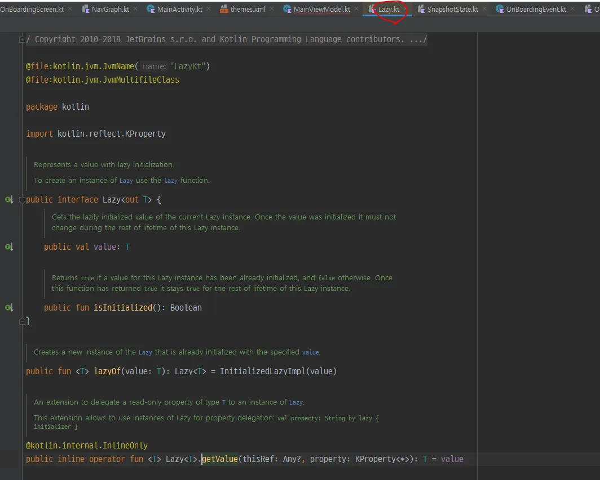
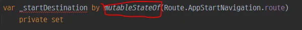
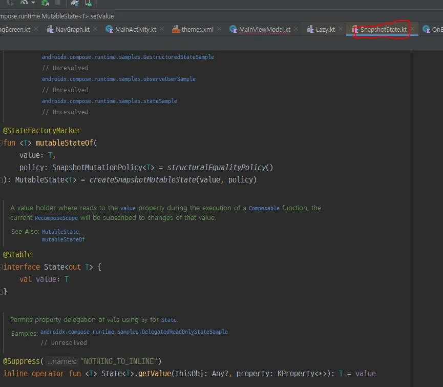
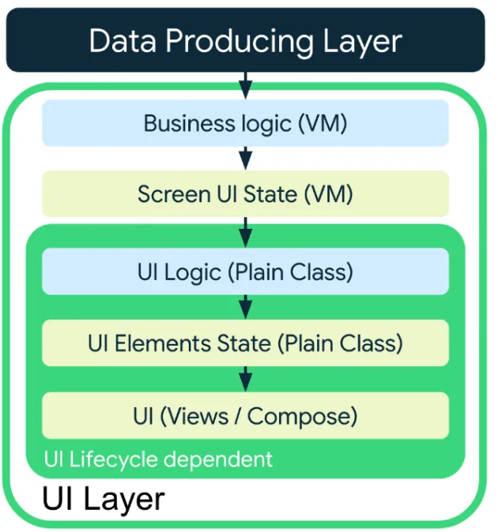

# by?

강의 듣다보면 아래 코드가 똑같이 동작하니까 저렇게 리팩토링 하는 부분이 나온다.

```kotlin
    private val _startDestination = mutableStateOf(Route.AppStartNavigation.route)
    val startDestination: State<String> = _startDestination

    // 뭔차이?
    var _startDestination by mutableStateOf(Route.AppStartNavigation.route)
        private set
```

디자인 패턴 중 **Delegate Pattern** 이라는 것이 있다. 코틀린의 **`by` 키워드**는 해당 디자인 패턴 구현을 쉽게 할 수 있도록 도와주는 키워드이다



**Delegate Pattern은 어떤 기능을 자신이 수행하지 않고 다른 객체가 수행하도록 위임 하는 패턴**

### 예제

```kotlin
interface IWindow {
    fun getWidth() : Int
    fun getHeight() : Int
}
```

그리고 위 인터페이스를 구현한 **`TransparentWindow`** 라는 클래스가 있다.

```kotlin
open class TransparentWindow : IWindow {
    override fun getWidth(): Int {
        return 100
    }

    override fun getHeight() : Int{
        return 150
    }
}
```

마지막으로 **`UI` 라는 클래스**가 있는데, 이는 **`TransparentWindow` 를 상속받진 않으나 `IWindow` 를 구현**했고, **Composition** 관계로 `TransparentWindow` 를 받기 위해 **`mWindow` 객체**를 갖게 된다. 그리고 **Delegate Pattern** 을 구현하기 위해 모든 메소드에 대해서 **`mWindow` 이 갖고있는 메소드를 호출함**으로써 기능을 위임시키게 된다.

```kotlin
class UI(window: IWindow) : IWindow {
    val mWindow: IWindow = window
    
    fun adsfasdf()

    override fun getWidth(): Int {
		    // mWindow를 통해 getWidth를 위임
        return mWindow.getWidth()
    }

    override fun getHeight(): Int {
		    // mWindow를 통해 getHeight를 위임
        return mWindow.getHeight()
    }
}
```

```kotlin
fun main() {
    val window: IWindow = TransparentWindow()
    val ui = UI(window)
    System.out.println("Width : ${ui.getWidth()}, height: ${ui.getHeight()}")
}
```

그렇게 되면 위와 같이 활용할 수 있는데 실제 동작은 window를 통해 getWidth, getHeight를 호출하는것과 아무런 차이가 없다.

### 그래서 장단점은?

- 장점
    - 상속을 사용하지 않아 유연성을 갖춘 채로 상위 클래스의 요소들을 사용할 수 있으며 새로운 기능을 자유자재로 덧붙여 사용할 수 있다
    - 내부 구현을 감출 수 있어 캡슐화 가능
    - 위 두 장점 덕분에 동일한 로직에 대한 재사용성 증가
- 단점
    - 보일러플레이트

## by : 보일러플레이트를 줄여주기 위한 코틀린 연산자

```kotlin
// 해당 코드에 대해 
var counter by mutableStateOf(0)

// 이렇게 동작합니다.
var counterDelegate = mutableStateOf(0)
var counter: Int
    get() = counterDelegate.value
    set(value) {
        counterDelegate.value = value
    }
```

실제로 Ctrl 클릭해서 따라 들어가보면 아래처럼 구현되어 있습니다.





그냥 value를 리턴하고 세팅해주는 코드를 대신 수행해주고 있음 (위임)

이것 때문에 

```kotlin
_startDestination.value = Route.NewsNavigation.route
_startDestination = Route.NewsNavigation.route
```

위 코드처럼 .value를 써서 접근하고 접근 안하고의 차이가 생긴것.

실제로 Delegate 패턴을 구현하려면 특정 매서드를 대신 수행해주는 코드를 작성해야 하기 때문에 보일러플레이트 코드가 늘어나고, 작업량도 늘어나지만 코틀린에서는 by키워드를 통해 이를 적절히 건너뛸 수 있도록 해주어서 수고를 덜어주고 있습니다.

## by 는 언제 쓸 수 있을까?

사실 by가 하는건 진짜 별거없다.









사진을 보면 알겠지만, by ( ) 처럼 by키워드 뒤에 붙은 클래스가 가지고 있는 getValue, setValue들로 연결시켜주는게 전부다.

따라서 내가 사용할 클래스에 자체적으로 getValue, setValue가 구현되어 있다면 by를 사용가능하다.

# State 관리에서 겪은 문제점과 해결법?

MVI, 단방향 데이터 흐름 등을 지키면서 개발하려고 하다보니 다음과 같은 문제에 부딪혔습니다.

- 최대한 Stateless하게 만드려 하다보니 부모 뷰에 너무 과도한 책임이 부여되고, 추후 복잡한 로직을 추가함에 있어서 부모뷰까지 거슬러 올라가서 뭔가 작업을 해야 했다.
- 뷰모델에서 모든 State를 직접 관리하려고 하다보면 아키텍처 때문에 효율적이지 않은 코드를 작성하게 된 적이 있다.

초반에는 모든 State를 전부 ViewModel에서 관리하는것이 맞다 생각했는데, 이미지 캐싱과 같은 특이 케이스에서는 오히려 독이되는 경우가 있었습니다.

따라서 어디서 State를 관리할지에 대해 다음과 같은 기준으로 나누었습니다.

- **ViewModel에서 관리하는 상태**
    - 네트워크 호출결과
    - 화면에서 전역적으로 공유되어야 하는 상태
- **로컬 View에서 관리하는 상태**
    - 단순 UI 상태, 한 번의 렌더링 주기 내에서만 필요한 상태
    - 특정 Composable 내부에서만 사용되는 상태

즉, 모든 State를 한군데에서만 관리하는게 아니라 로컬 **UI element State**들과 **Business logic State**를 명확하게 나누어 관리하는것이 핵심이며 아래 다이어그램을 통해 시각화해볼 수 있습니다.



- 비즈니스 로직을 통해 DataLayer에서 가져온 데이터는
- 화면에 표시해야 할 상태로써 뷰모델에서 가공됩니다.
- 이러한 상태는 Screen에서 전역적으로 공유되어야 하는 상태이며 뷰모델 레벨에서 관리되는것이 바람직합니다.
- Screen단위의 상태는 UI 로직을 통해 UI Element State로 가공됩니다.
- 이러한 UI Element State는 UI라이프사이클에 종속되며 각 UI 컴포넌트가 생성되고 파괴됨에 따라 함께 생성되고 파괴되어야 합니다.
- 따라서 UI LifeCycle보다 긴 수명주기를 갖는 뷰모델에서 UI element state들을 관리할경우 메모리누수를 일으키게 됩니다.
- 따라서 UI element State들은 Composable 레벨에서 관리되어야 합니다.

예를 들어보면 **Screen State는 네트워크에서 fetch해 온 전체 이미지 리스트 소스**에 해당하며, **UI element State는 각각 리스트 아이템에 렌더링할 Bitmap 객체**라고 볼 수 있겠네요.

수백 수천장의 이미지를 모두 비트맵 객체로써 뷰모델이 관리한다면 당연히 **메모리 누수**가 일어나고 **앱이 다운**될지도 모릅니다.

사실상 지금까지는 ViewModel을 State Holder로써 사용하면서 모든 State를 뷰모델에서 관리하려 했지만, UI element State 를 정의하여 따로 관리하고자 한다면 이들의 역할을 분리하고 State holder 클래스를 새로 정의할 필요가 있습니다.

- Business logit State : ViewModel에서 관리
- UI element State : State Holder 에서 관리

# **비즈니스로직과 Screen level의 state holder로는 AAC ViewModel을 활용하라**

ViewModel은 Composable보다 생명주기가 길기 때문에 화면회전과 같은 이벤트에 대응할 수 있습니다. 따라서 네트워크 호출과 같은 **비즈니스 로직에 해당하는 상태는 불필요한 중복호출을 줄이기 위해 뷰모델에서 관리**해야합니다.

```jsx
@HiltViewModel
class AuthorViewModel @Inject constructor(
    savedStateHandle: SavedStateHandle,
    private val authorsRepository: AuthorsRepository,
    newsRepository: NewsRepository
) : ViewModel() {

    val uiState: StateFlow<AuthorScreenUiState> = …

    private val _userInfo = mutableStateOf(UserInfo())
    val userInfo: State<UserInfo> = _userInfo

    private fun getUserInfo() = viewModelScope.launch {
        userInfoRepository.getUserInfo().collectLatest {
            it?.let {
                _userInfo.value = it
            }
        }
    }

    // Business logic
    fun followAuthor(followed: Boolean) {
      …
    }
}
```

# UI level State는 컴포저블 자신 또는 plain state holder class를 만들어 관리하라

보통 UI에 종속되는 State들은 아래와 같이 컴포저블에서 내부적으로 상태를 관리하도록 구현하곤 했습니다.

```jsx
@Composable
fun ModifyNicknameScreen() {
    val expanded = remember {
    	mutableStateOf(false)
    }
    var textFieldValue = remember {
        val initValue = ""
        val textFieldValue =
            TextFieldValue(
                text = initValue,
                selection = TextRange(initValue.length),
            )
        mutableStateOf(textFieldValue)
    }
    
    Column() { 
	    TextField(
        	value = textFiledValue,
            // ...
        )
    }
}
```

그러나 하나의 컴포저블에서 관리하는 상태가 많아지면 코드가 복잡해지고, 어느 상태까지 호이스팅을 하고 어느 상태까지 직접 관리해야 하는지 혼동이 오곤 합니다.

```kotlin
// Plain State Holder Class with Initial Value
@Stable
class CounterState(initialCount: Int = 0) {
    var count by mutableStateOf(initialCount)
        private set

    fun increaseCount() {
        count++
    }
}

// Remembable helper function
@Composable
fun rememberCounterState(initialCount: Int = 0): CounterState {
    return remember { CounterState(initialCount) }
}

@Composable
fun CounterApp() {
    // State Holder 인스턴스를 remembable 하게 유지
    val counterState = rememberCounterState(initialCount = 5)

    Column(
        modifier = Modifier.fillMaxSize(),
        verticalArrangement = Arrangement.Center
    ) {
        Text(
            text = "Counter: ${counterState.count}",
            style = MaterialTheme.typography.headlineLarge
        )

        Spacer(modifier = Modifier.height(16.dp))

        Button(onClick = { counterState.increaseCount() }) {
            Text("Increase Count")
        }
    }
}
```

initial value 를 받아 State를 나타내고, 내부적으로 State를 변경시킬 수 있는 Plain class를 생성했습니다.

또한 custom rememberable 매서드를 통해 Composable에서 하나의 remember 가능한 상태로써 활용할 수 있습니다. 

위 예제에서는 count라는 하나의 상태값만 wrapping 했지만, 하나의 Composable에서 사용하는 여러 State들을 하나의 Custom State로 wrapping하여 활용하면 더욱 가독성있는 코드를 짤 수 있을 뿐만 아니라 세세한 상태값의 업데이트 로직 또한 Custom State에 위임함으로써 관심사의 분리를 이끌어낼 수 있습니다.

# @Stable

CounterState 클래스를 보면 상위에 **@Stable** 어노테이션이 달려있습니다.

Stable상태와 Unstable 상태에 대해 먼저 정의해보면 아래와 같습니다.

- **Stable** : Recomposition 일 발생했을 때 parameter 가 Stable 하다면 Compose Runtime 에서 Recomposition 을 건너뛰는 것(Skippable)이 가능한 상태
- **Unstable** : 상위 Composable 함수에서 Composition, Recomposition 이 발생했을 때, 항상 Recomposition 이 발생하는 상태

리컴포지션을 유도하기 위해 State의 변화를 감지하고, 자식 Composable에게 리컴포지션을 전파하는등 여러 장치가 있다면, 불필요한 리컴포지션을 적절히 스킵할 수 있는 장치또한 존재해야 최적화를 할 수 있겠죠? 그러한 장치가 바로 @Stable 어노테이션입니다.

```kotlin
@Composable
fun ContactRow(contact: Contact) {
  var selected by remember { mutableStateOf(false) }
  Row {
    ContactDetails(contact)
    ToggleButton(selected, onToggled = { selected = !selected })
  }
}
```

위와 같은 컴포저블이 있다고 예를 들어봅시다.

ToggleButton이 눌려 selected가 재설정 되면, ContactRow가 리컴포지션 되면서 불필요하게 ContactDetails까지 리컴포지션이 되게 되는데, 사실 contact는 변경이 없기 때문에 **리컴포지션이 스킵**되도록 해야 합니다. (이를 **스마트 리컴포지션**이라 부릅니다.)

따라서 contact 라는 State에 @Stable 어노테이션을 달아주어서 이 상태값은 안정한 상태이니 스마트리컴포지션이 적용되도록 해주세요~ 하는 역할을 해주는 것입니다.

근데 이 안정성 시스템이라는 개념 자체가 아직 잘 이해가 안되고 너무 방대한것 같아서

다음시간에 다시 다뤄보도록 하겠습니다…ㅎㅎ