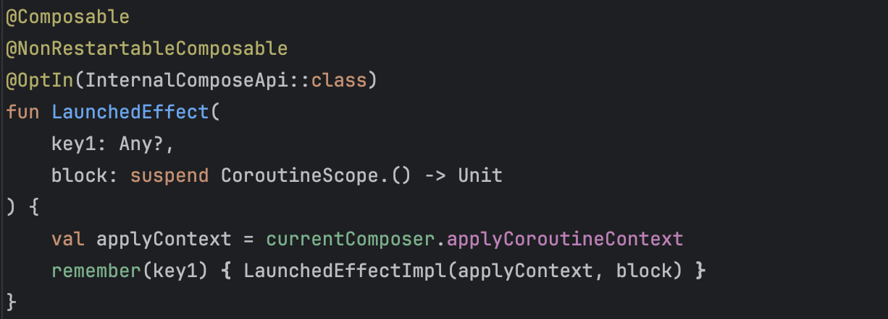
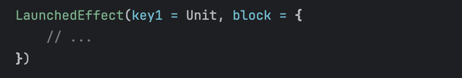
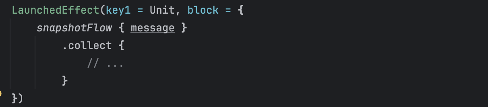
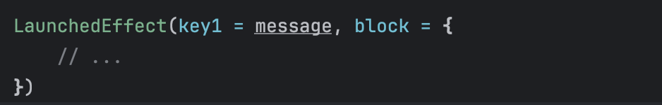
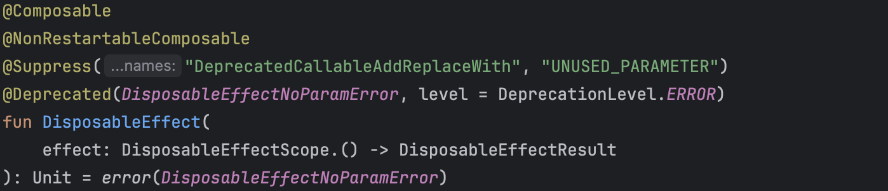
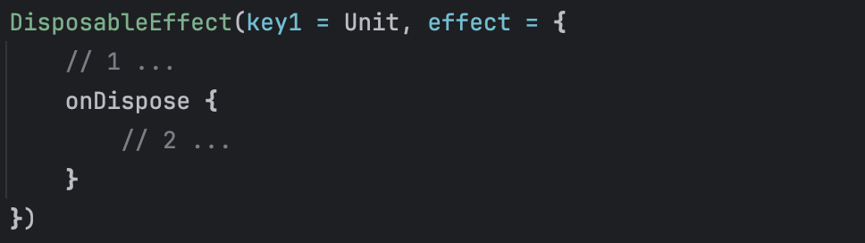
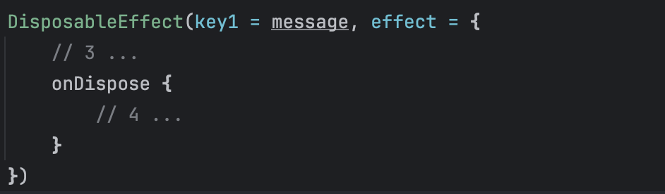
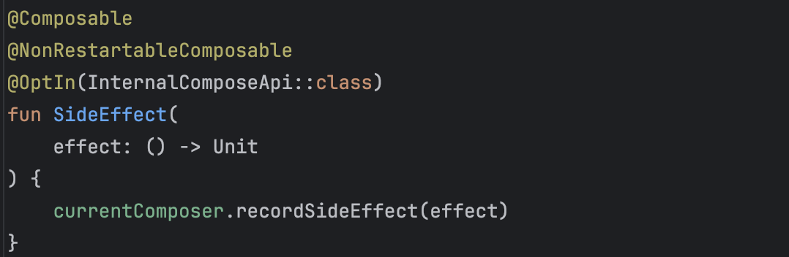
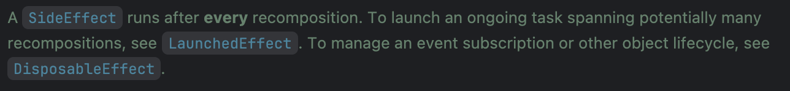

## 💡 들어가기
- 해당 주제에 대한 선정이유 (순수하게 궁금해서 이런것도 OK)
    - 실습할 때 LaunchedEffect와 SideEffect가 나왔는데 뭐가 다른건지 궁금해서
- 참고자료 레퍼런스
    
    https://developer.android.com/develop/ui/compose/side-effects?hl=ko
    
    https://medium.com/@mortitech/exploring-side-effects-in-compose-f2e8a8da946b
    
    https://heegs.tistory.com/162
    

</aside>

# Side Effect 함수들

### 필요성

성능 향상의 관점에서 UI에서 발생하는 Effect들을 관리하는 것은 중요하다. 

UI에서 발생하는 Effect를 효율적으로 관리하는 함수로 SideEffect, LaunchedEffect, DisposableEffect 가 있다.

### Side Effect

- Composable 함수 내에서, 함수 외부에서 관리되는 상태들을 제어하기 위해 사용한다.
- Side Effect는 성능 향상과 유지보수의 관점에서 UI 렌더링 로직과 반드시 분리되어야 한다.
- Ex) 스낵바 표시, 특정 상태 조건에 따라 다른 화면으로 이동하는 일회성 이벤트

### Side Effect 관련 함수들을 사용했을 때의 장점

- **`성능 향상`**
    - UI와 관련 없는 연산들은 Composable 외부에서 실행시켜 UI 렌더링 성능을 보존할 수 있다.
- **`코드 구성 개선`**
    - UI와 분리시킴으로써 코드를 가독성 있게 유지보수할 수 있다.
- **`프로덕트 품질 개선`**
    - Side Effect들은 이벤트 로깅과 데이터 수집할 때 사용할 수 있다. 이를 통해 사용자들의 행동 추적, 이슈 파악이 쉽게 가능하다.


# LaunchedEffect



- key값이 변경될 때마다 이하 block 영역을 비동기로 수행한다.

**`방식 1`**



- key값에 Unit을 넣어서 해당 함수가 반드시 한번만 호출되도록 구현한다.
- Compose 내부에 작성하는 경우에는 해당 UI가 그려지는 경우 반드시 전체적으로 다시 수행되지만, **LaunchedEffect 안에 있는 block은 recomposition이 발생해도 다시 수행되지 않는다.**

**`방식 2`**



- snapshotFlow
    - 지정한 데이터에 대해 관찰이 가능하도록 flow를 만들고, 관찰 중인 데이터의 변경을 기록한다.
- 위의 함수는 compose 함수가 실행될 때 최초 한 번만 호출이 되는데, message의 변화를 탐지할 수 있는 snapshotFlow를 만들고, message가 변경될 때마다 collect 이하 부분을 실행한다.

### 🤔 그렇다면 다음 둘의 차이점은 뭘까?



- message가 변경될 때마다 block을 실행한다.


- 최초 한번 실행될 때 message값을 관찰하도록 하고, 변경될 때 block을 실행한다.

→ 동작은 같으나 동작을 수행하기까지의 과정이 다르다!


# DisposableEffect



- LaunchedEffect와 비슷하게 보이지만, block 대신 effect로 되어 있는 DisposableEffectScope가 존재한다.
- DisposableEffectResult가 onDispose를 포함하고 있기 때문에 반드시 override 해서 사용해야 한다.

**`방식 1` Unit**



- key 값이 변할 때마다 effect 영역을 비동기로 수행한다.
- 최초 한번 1번 영역을 실행하고, Compose를 떠날 때 2번 영역을 실행한다.

**`방식 2` Unit X**



- message 값이 변경될 때마다 DisposableEffect가 다시 실행된다.
- 실행 흐름
    - message가 처음 설정되면:
        - **`(3) 실행`** → 새로운 효과 실행
    - message 값이 변경될 때마다:
        - **`(4) 실행`** (onDispose) → 기존 효과 정리
        - **`(3) 실행`** → 새로운 message 값을 반영한 효과 실행
    - Composable이 화면에서 사라지면:
        - **`(4) 실행`** (onDispose) → 마지막으로 실행된 효과 정리

---

### LaunchedEffect와 DisposableEffect는 key 값에 따라서 이하 함수를 실행한다.

### 🤔 *key값을 떠나서 화면이 다시 recomposition 될 때마다 함수를 수행시키려면?*


# SideEffect





→ recomposition이 성공적으로 수행된다면 effect 영역이 반드시 호출된다!


# 각 함수의 사용 예시

### LaunchedEffect


> `비동기` UI 스레드를 블락하지 않고 긴 시간의 작업(네트워크 호출, 애니메이션)을 처리할 때 사용**

</aside>

- 네트워크에서 데이터를 가져오는 경우
    - 코드
        
        ```kotlin
        @Composable
        fun MyScreen(userId: String) {
            var userData by remember { mutableStateOf<User?>(null) }
        
            LaunchedEffect(userId) {
                userData = fetchUserData(userId) // 네트워크 요청 (Side-Effect)
            }
        
            Text(text = userData?.name ?: "Loading...")
        }
        ```
        
        → recomposition이 발생해도, userId가 바뀌지 않으면 네트워크 요청을 하지 않는다.
        
- 이미지/영상 처리
- DB 업데이트

### DisposableEffect

<aside>

**Composable함수가 UI에서 제거될 때 실행되지 않아야 하는 로직을 수행할 때 사용**

```kotlin
onDispose {
	job.cancel
}
```

**→ coroutine을 취소하여 리소스 관리를 보장한다.**

</aside>

- 이벤트 리스너 부착/탈착
- 애니메이션 시작/중지

### SideEffect

- 이벤트 로깅/데이터 수집
- 블루투스 기기 연결, 파일 데이터 로드, 라이브러리 초기화 같은 일회성 초기화 로직 실행
    - 코드
        
        ```kotlin
        @Composable
        fun MyComposable() {
            val isInitialized = remember { mutableStateOf(false) }
        
            SideEffect {
                if (!isInitialized.value) {
                    // 한번만 실행해야 하는 로직을 넣는다
                    initializeBluetooth()
                    loadDataFromFile()
                    initializeLibrary()
                    
                    isInitialized.value = true
                }
            }
        
            // UI 관련 코드
        }
        ```